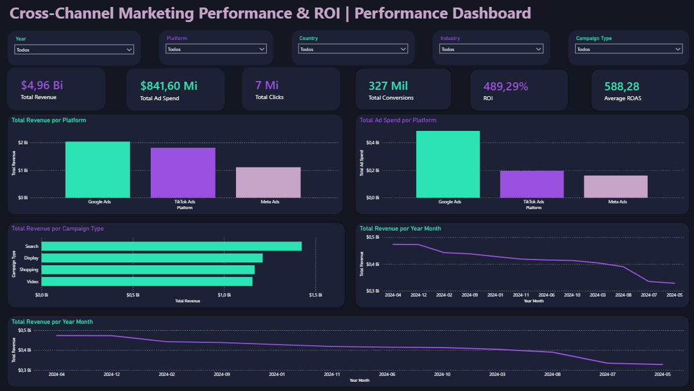
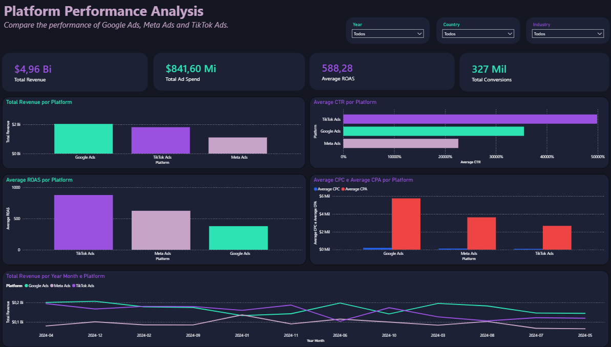
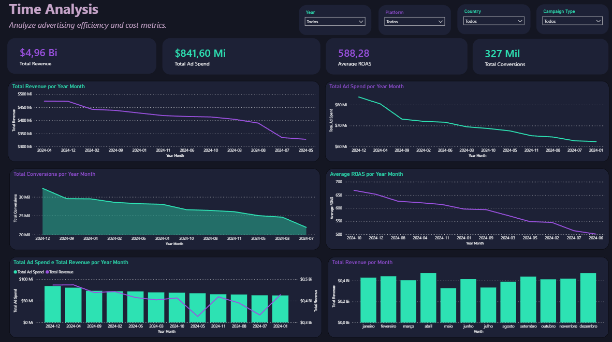

# 📊 Cross-Channel Marketing Performance Dashboard

## 📌 Overview

This project presents an interactive Power BI dashboard developed to analyze marketing performance across three major advertising platforms:

- Google Ads
- Meta Ads
- TikTok Ads

The dashboard enables business users to monitor campaign performance, identify trends, compare platforms, and evaluate return on investment using key marketing metrics.

---

## 📁 Dataset

Source:

Global Ads Performance Dataset (Kaggle)

The dataset contains advertising data including:

- Revenue
- Ad Spend
- Clicks
- Conversions
- ROAS
- CPC
- CPA
- CTR
- Industry
- Country
- Campaign Type
- Platform

---

## 🛠 Tools Used

- Power BI Desktop
- Power Query
- DAX
- Data Modeling

---

# Dashboard Pages

## 1️⃣ Executive Overview

Provides a high-level summary of marketing performance.

Main KPIs:

- Total Revenue
- Total Ad Spend
- Total Clicks
- Total Conversions
- ROI
- Average ROAS

Main Charts

- Revenue by Platform
- Ad Spend by Platform
- Revenue by Campaign Type
- Revenue Over Time

---

## 2️⃣ Campaign Analysis

Focuses on campaign performance.

Includes:

- Revenue by Campaign Type
- CTR by Campaign Type
- CPC vs CPA
- Campaign Performance
- Conversion Analysis

---

## 3️⃣ Market Analysis

Analyzes performance across industries and countries.

Includes:

- Revenue by Industry
- Revenue by Country
- Platform Distribution
- Top Markets

---

## 4️⃣ Time Analysis

Evaluates trends over time.

Includes:

- Revenue Trend
- Ad Spend Trend
- ROAS Trend
- Conversions Trend
- Monthly Comparison

---

## 📷 Dashboard Preview

### Executive Overview

---

### Platform Performance

---

### Campaign & Market Analysis

---

### Time Analysis

---

## 📈 Key Insights

- Google Ads generated the highest revenue.
- Search campaigns outperformed other campaign types.
- SaaS showed the strongest revenue among industries.
- Revenue decreased over the analyzed period.
- ROAS remained high despite lower monthly revenue.

---
